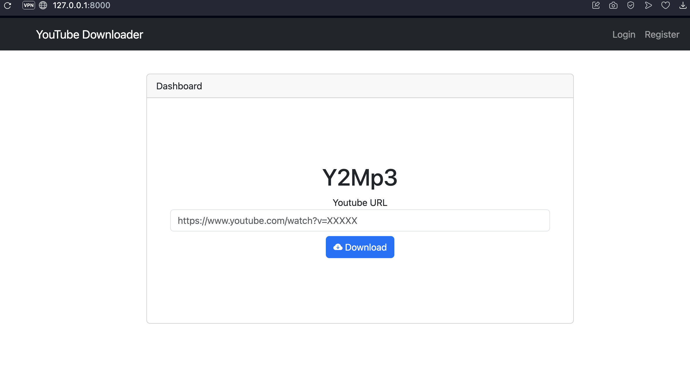
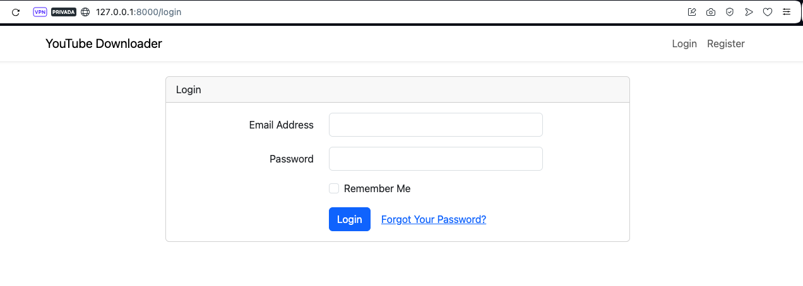

# YouTube Downloader PHP
Make your own YouTube Downloader Mp3 Site

## Requisites
* Linux
* php
* Web server
* Composer
* yt-dlp  (https://github.com/yt-dlp/yt-dlp)
* ffmpeg (https://ffmpeg.org/)


## Install ffmpeg & yt-dlp in linux for Video and Audio convertions
### Linux
```bash
sudo apt install ffmpeg yt-dlp -y
```

### Mac
```bash
brew install ffmpeg yt-dlp
```

## Install Website
Copy distributed environment file, and setup DB variables
```bash
cp .env.example .env
```
Run composer, set key and run migrations
```bash
composer install
php artisan key:generate
php artisan migrate
```

## Local test
```bash
php artisan serve
```


### Disable Auth in HomePage

Just comment this line __construct of HomeController.php
```php
//$this->middleware('auth');
```

